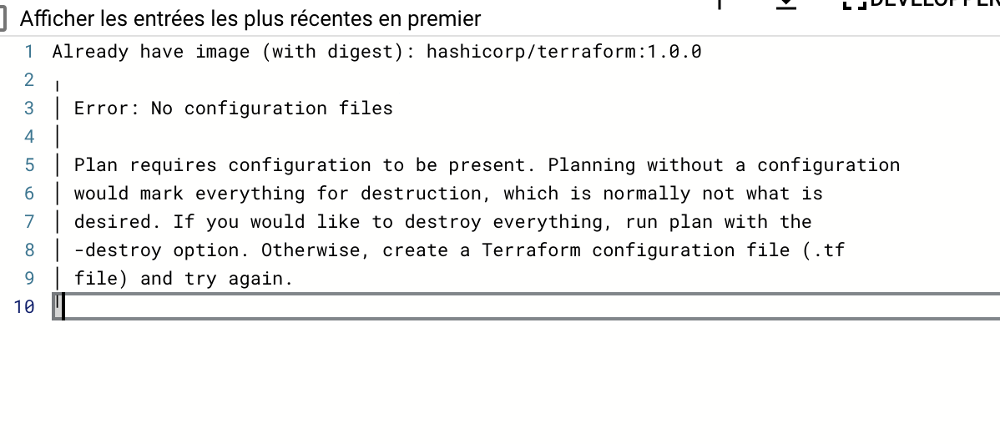

# Pipeline Cloud Build pour automatiser le déploiement de ressources avec Terraform sur GCP

Cet exemple permet de déployer sur un projet GCP les ressources suivantes :
- `google_project_service` => Les APIs Google nécessaire à l'utilisation des resources
- `google_artifact_registry_repository` => dépôt docker permettant de stocker des images (comme DockerHub)

## Pré-requis :
Changer les valeurs suivantes dans ce code pour les adapter à votre configuration :

`backend.tf` :


```hcl
provider "google" {
    project = "devops-dauphine-psl"
}
```

=> Remplacer `devops-dauphine-psl` par le nom de votre projet GCP

```hcl
  backend "gcs" {
    bucket = "testbucket-dauphine-devops"
  }
```

=> Renseigner un nom de bucket que vous avez crée :
  - soit directement sur l'interface Web GCP
  - soit en utilisant terraform en local sans configuration backend `gcs` (le code pour la création du bucket est commenté dans `main.tf`)

## Debug en case de problème

### AUTH_PERMISSION_DENIED, rôles manquants dans CloudBuild


Erreur contenant : `googleapi: Error 403: Permission denied`

[Comme pour le TP3](https://cloud.google.com/docs/terraform/resource-management/managing-infrastructure-as-code?hl=fr#granting_permissions_to_your_cloud_build_service_account), nous devons donner les droits à CloudBuild de créer des ressources sur notre projet Google.
En effet, par défault CloudBuild n'a pas les autorisation pour faire les appels APIs nécessaires à la création de ressources.


Pour faire simple, on donne tous les droits à CloudBuild sur notre projet Google avec le rôle `roles/editor`.

Utilisez les 3 commandes suivantes :

```bash
PROJECT_ID=$(gcloud config get-value project)
```

```bash
CLOUDBUILD_SA="$(gcloud projects describe $PROJECT_ID \
    --format 'value(projectNumber)')@cloudbuild.gserviceaccount.com"
```

```bash
gcloud projects add-iam-policy-binding $PROJECT_ID \
    --member serviceAccount:$CLOUDBUILD_SA --role roles/editor
```

### Erreur "Backend configuration changed"


Attention, si vous utilisez directement la commande : `gcloud builds submit --config cloudbuild.yaml`, il faut veiller à ne pas envoyer le dossier `.terraform` (généré automatiquement si vous avez utilisé terraform directement sans cloudbuild) ce qui perturbe CloudBuild.

Afin de ne pas soumettre ce dossier, on définit le fichier `.gcloudignore` qui contient l'exclusion :

```bash
.terraform
```

## Erreur : Échec du déclenchement de la compilation: File */cloudbuild.yaml not found


=> Si on utilise un trigger / déclencheur CloudBuild:

Pour le fichier `cloudbuil.yaml` :


-> spécifier le bons chemin relatif à utiliser qui pointe vers votre `cloudbuil.yaml`

## Erreur : │ No configuration files



S'assurer que cloudbuild s'execute bien où on le souhaite = à côté de nos fichiers terraform (`main.tf`).

Pour mieux comprendre où se lance CloudBuild, on peut rajouter une étape qui affiche les fichiers courants :

```YAML
  - name: 'bash'
    script: |
      #!/usr/bin/env bash
      echo $(ls)
```

=> Si on lance avec `gcloud builds submit --config cloudbuild.yaml`, s'assurer qu'on fait la commande au bon endroit
=> Si on utilise un déclencheur, faire en sorte d'être dans le bon dossier pour faire nos commandes `terraform`

Pour changed de dossier, on peut faire comme vu au TP 3

```YAML
- id: 'tf init'
  name: 'hashicorp/terraform:1.0.0'
  entrypoint: 'sh'
  args:
  - '-c'
  - |
      cd MON_CHEMIN/RELATIF/
      terraform init
```

Ou alors utiliser le mot clé `dir` :

```YAML
  - id: 'terraform init'
    name: 'hashicorp/terraform:1.0.0'
    dir: MON_CHEMIN/RELATIF
    script: terraform init
```