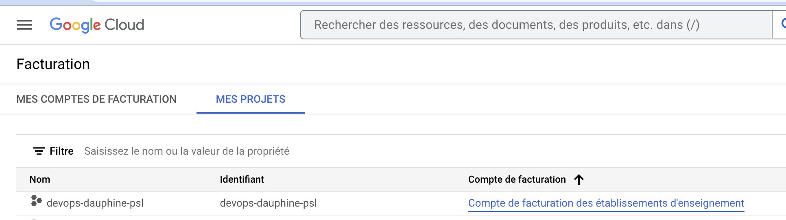

# Setup pour Terraform

- S'assurer que le projet sur lequel on veut déployer possède bien le compte de facturation


- Utiliser les commandes pour s'authentifier :

```bash
gcloud auth login # Ouvre une fenêtre avec demande d'autorisation
gcloud auth application-default login
```

# Créer les ressources

```bash
terraform init
```

```bash
terraform plan
```


```bash
terraform apply
```


```bash
terraform destroy
```