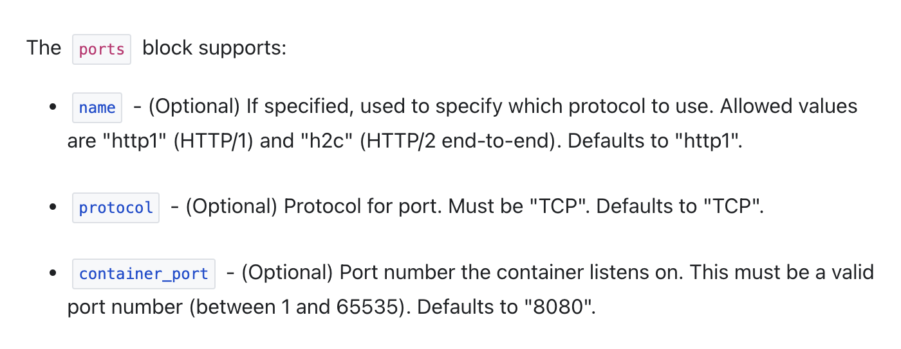

# TP 4

Si vous en êtes arrivés ici, c'est que vous avez tous les outils nécessaires pour délivrer une application en production en utilisant une approche DevOps 😎

Il est temps de mettre bout à bout vos connaissances 😌

### Utiliser terraform et cloud build pour déployer une application

Reprendre le code de l'application Node utilisée dans le TP 1 :

- App.js :

```js
cat > app.js <<EOF
const http = require('http');
const hostname = '0.0.0.0';
const port = 80;
const server = http.createServer((req, res) => {
    res.statusCode = 200;
    res.setHeader('Content-Type', 'text/plain');
    res.end('Hello World\n');
});
server.listen(port, hostname, () => {
    console.log('Server running at http://%s:%s/', hostname, port);
});
process.on('SIGINT', function() {
    console.log('Caught interrupt signal and will exit');
    process.exit();
});
```

- Dockerfile

```dockerfile
# Use an official Node runtime as the parent image
FROM node:lts
# Set the working directory in the container to /app
WORKDIR /app
# Copy the current directory contents into the container at /app
ADD . /app
# Make the container's port 80 available to the outside world
EXPOSE 80
# Run app.js using node when the container launches
CMD ["node", "app.js"]
```

Votre code terraform doit :
-> Activer les APIs nécessaires sur votre projet
-> Créer le repo Artifact Registry

Votre pipeline Cloud Build doit :
-> Appliquer les changements de votre code terraform sur votre projet
-> Build et push l'image docker sur une repo Artifact Registry

Bonus : déployer l'image docker sur une instance [Cloud Run](https://cloud.google.com/run?hl=fr) définie en code terraform. Faites attention au mapping des ports 😉 : [Config Cloud Run](https://cloud.google.com/run/docs/container-contract?hl=fr) & [Cloud Run Terraform](https://registry.terraform.io/providers/hashicorp/google/latest/docs/resources/cloud_run_service)

